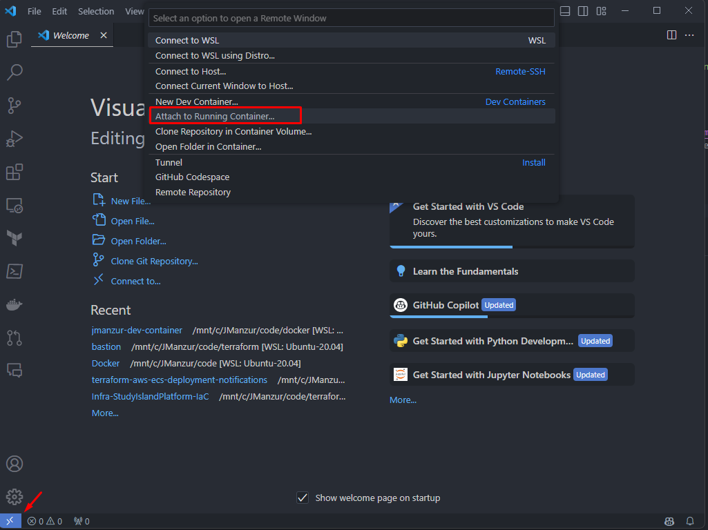

# JManzur Dev Container

Sometimes I need a clean/fresh environment to test or troubleshoot stuff. To address this need, I've crafted a container replete with the tools I commonly use. This container seamlessly integrates with the VS Code Dev Container feature. It is built upon the foundation of the [latest Ubuntu image](https://hub.docker.com/_/ubuntu) and comes equipped with an array of essential tools, including:

- openssl
- git
- wget
- gnupg
- software-properties-common
- curl
- vim
- unzip
- htop
- tree
- jq
- telnet
- ping
- Terraform
- AWS CLI
- Boto3
- Oh My Bash
- Redis CLI
- Kubectl
- Helm
- Go
- [eks-node-viewer](https://github.com/awslabs/eks-node-viewer)
- And much more! This is a ever-growing list. For a up-to-date list of installed packages, please refer to the [Dockerfile](Dockerfile).

Yep... is a chubby boy 🐽, but it includes all the tools I need to get the job done. 😎

## How to use it:

You can pull the image from [Docker Hub](https://hub.docker.com/r/jmanzur/dev-container), or clone this repo and build it locally.

To pull and run the image from Docker Hub on your local machine:

```bash
docker run --rm --name jmanzur-dev-container -ti jmanzur/dev-container:latest /bin/bash
```

To build the image locally and run it:
```bash
git clone https://github.com/JManzur/jmanzur-dev-container.git
cd jmanzur-dev-container
docker build -t jmanzur-dev-container .
docker run --name jmanzur-dev-container -ti jmanzur/dev-container /bin/bash
```

You can also use the rebuilder script to build the image locally:

```bash
git clone
cd jmanzur-dev-container
chmod +x rebuild_image.sh
./rebuild_image.sh
docker run --name jmanzur-dev-container -ti jmanzur/dev-container /bin/bash
```

> [!WARNING]
> Using the --rm flag will automatically remove the container when it exits. If you want to keep the container around to inspect it later, you can remove the --rm flag and use `docker rm jmanzur-dev-container` to remove it when you’re done.

## How to use it in a Kubernetes cluster:

To pull and run the image from Docker Hub on an Kubernetes cluster:

```bash
kubectl run jmanzur-dev-container --image=jmanzur/dev-container:latest --restart=Never --rm -ti -- /bin/bash
```

If you want to run the container in a specific namespace, you can add the `-n` flag:

```bash
kubectl run jmanzur-dev-container -n <namespace> --image=jmanzur/dev-container:latest --restart=Never --rm -ti -- /bin/bash
```

If you need to add a pod label, you can use the `--overrides` flag:

```bash
kubectl run jmanzur-dev-container -n <namespace> --image=jmanzur/dev-container:latest --restart=Never --rm -ti --overrides='
{
  "apiVersion": "v1",
  "metadata": {
    "annotations": {
      "sidecar.istio.io/inject": "false"
    }
  }
}' \
  -- /bin/bash
```

## Mounting a volume:

You can mount a volume to the container to access files on your local machine. For example, to mount the current directory to the `/workspace` directory in the container:

```bash
docker run --rm --name jmanzur-dev-container -ti -v $(pwd):/workspace jmanzur/dev-container:latest /bin/bash
```

## How to use it with VS Code:

1. Install the [Remote - Containers](https://marketplace.visualstudio.com/items?itemName=ms-vscode-remote.remote-containers) extension in VS Code.
2. Click the "Open a Remote Window" button in the lower left corner of VS Code and select "Attach to Running Container..."
3. From the pick list, select the jmazur-dev-container container.



> [!NOTE]
> The jmazur-dev-container container must be running before you can attach to it.

## Author:

- [@JManzur](https://jmanzur.com)